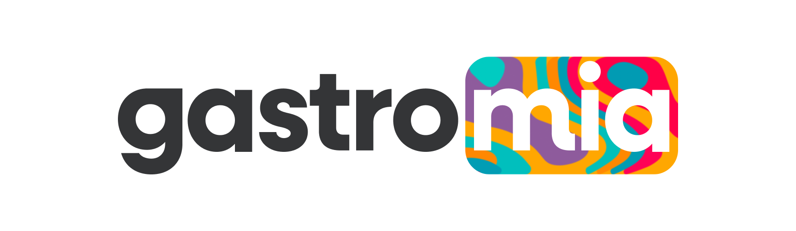
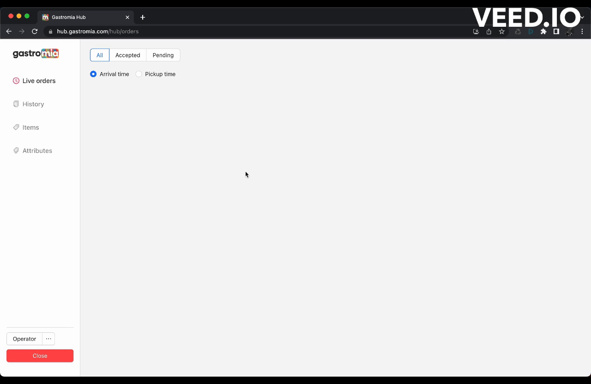

## What is Hub Manager?

The hub manager is a web app developed with desktop use in mind to provide a streamlined kitchen manager for Gastromia's operations. 

The hub manager allows the kitchen staff to control the flow of live orders, as well as update the status of all the items on the menu. The changes are then reflected on the users' Gastromia app. 

On top of that, staff members are able to use the hub manager to add, update or remove any item present on the kitchen's menu. 

Finally the dashboard allows the staff to easily visualize all previous orders, and their respective status, and order details. 

## Tech Stack

Backend:

- NodeJS
- Express
- AWS SDK
- Mongoose
- Twilio SDK
- Stripe SDK

Frontend:

- React
- React Router
- React Stripe (iframes for custom payment input)

Services:

- AWS S3 + CloudFront (Storage and delivery of media assets)
- Twilio Verify (OTP Authentication)
- Whatsapp Business Platform (Order updates)
- MongoDB Atlas (DB)

## Stages

### Refund order

### Item unavailable

### Edit item

