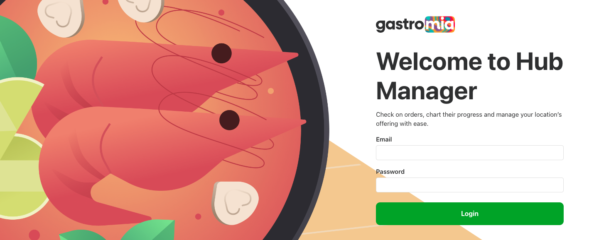
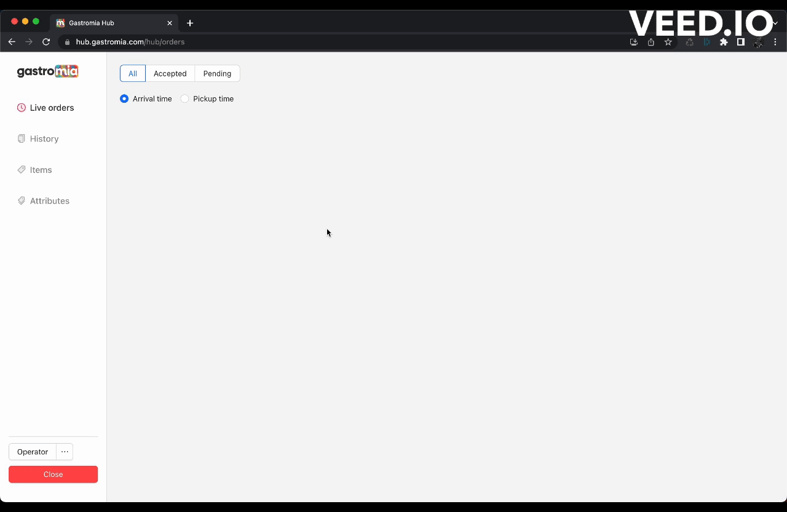

This repository is part of a wider online ordering and kitchen management system that powers the day-to-day operations of Gastromia – a food-tech startup that operates in the realm of ghost kitchens and virtual food brands.

The core components that make up the system are:

- [web-gastromia](https://github.com/fredgrd/web-gastromia/) – Customer-facing mobile web-app
- [hub-gastromia](https://github.com/fredgrd/hub-gastromia/) – Internal dashboard (live orders, item editing, statistics)
- [api-gastromia](https://github.com/fredgrd/api-gastromia/) – Backend powering both web apps and connected services.

## What is [hub-manager](https://hub.gastromia.com/)?

The hub manager is a web app developed with tablet use in mind. Its goal is to provide a streamlined kitchen dashboard to power Gastromia's kitchen operations.

The hub manager allows the kitchen staff to control the flow of live orders, and update the items' availability. The changes are then reflected on the customer-facing [client](https://gastromia.com).

On top of that, staff members are able to use the hub manager to add, update or remove any item present on the menu.

Finally the dashboard allows the staff to easily visualize all previous orders, along with their respective status and details.

## Tech Stack

Backend:

- Node.js
- Express
- AWS
- Mongoose
- Twilio Verify
- Stripe

Frontend:

- React
- React Router
- React Stripe (iframes for custom payment input)

Services:

- AWS S3 + CloudFront (Storage and delivery of media assets)
- Twilio Verify (OTP Authentication)
- Whatsapp Business Platform (Order updates)
- MongoDB Atlas (DB)

## Stages

### Refund order

### Item unavailable

### Edit item

